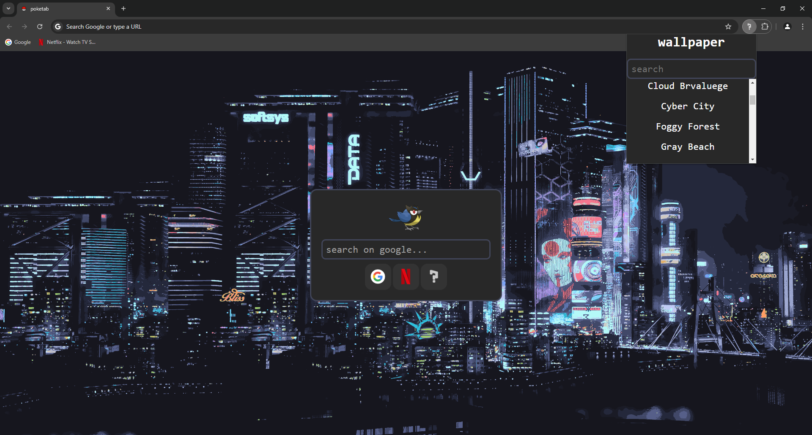
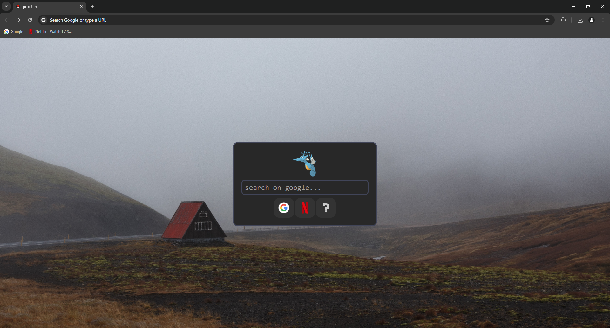

  

<h1 align="center">poketab</h1>

## About
Poketab is an extension that gives you a simple new tab interface for Chrome or other browsers.

## Installation (Ill add it to the chrome webstore later on maybe)
Go to chrome://extensions
Enable Developer Mode
Load the Unpacked/Packed extension

## Features
- Customize wallpaper
- Different Pokémon every visit
- Shows bookmarks

## Showcase

## Credits
- [Max Hu's Wallpapers](https://github.com/maxhu08/wallpapers)
- [Get favicons from any domain using a hidden google API](https://dev.to/derlin/get-favicons-from-any-website-using-a-hidden-google-api-3p1e)
